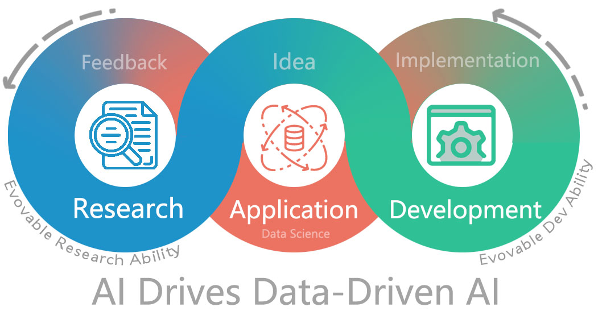

TODO: Add badges.

# 📰 News
| 🗞️News        | 📝Description                 |
| --            | ------                        |
| First release | RDAgent are release on Github |


# 🌟 Introduction



RDAgent aims to automate the most critical and valuable aspects of the industrial R&D process, and we begins with focusing on the data-driven scenarios to streamline the development of models and data. 
Methodologically, we have identified a framework with two key components: 'R' for proposing new ideas and 'D' for implementing them.
We believe that the automatic evolution of R&D will lead to solutions of significant industrial value.


<!-- Tag Cloud -->
R&D is a very general scenario. The advent of RDAgent can be your
- [🎥Automatic Quant Factory]()
- Data mining agent: iteratively proposing [🎥data]() & [models]() and implementing them by gaining knowledge from data.
- Research copilot: Auto read [🎥research papers]()/[🎥reports]() and implement model structures or building datasets.
- ...

You can click the [🎥link]() above to view the demo. More methods and scenarios are being added to the project to empower your R&D processes and boost productivity.

We have a quick 🎥demo for one use case of RDAgent.
- TODO: Demo


# ⚡Quick start
You can try our demo by running the following command:

### 🐍 Create a Conda Environment
- Create a new conda environment with Python (3.10 and 3.11 are well tested in our CI):
  ```sh
  conda create -n rdagent python=3.10
  ```
- Activate the environment:
  ```sh
  conda activate rdagent
  ```

### 🛠️ Run Make Files
TODO: `pip install rdagent` in the future.

- **Navigate to the directory containing the MakeFile** and set up the development environment:
  ```sh
  make dev
  ```

### 📦 Install Pytorch
TODO: use docker in quick start intead.

- Install Pytorch and related libraries:
  ```sh
  pip3 install torch torchvision torchaudio --index-url https://download.pytorch.org/whl/cpu
  pip3 install torch_geometric
  ```

### ⚙️ Environment Configuration
- Place the `.env` file in the same directory as the `.env.example` file.
  - The `.env.example` file contains the environment variables required for users using the OpenAI API (Please note that `.env.example` is an example file. `.env` is the one that will be finally used.)
  - please refer to [Configuration](docs/build/html/installation.html#azure-openai) for the detailed explanation of the `.env`
- Export each variable in the `.env` file:
  ```sh
  export $(grep -v '^#' .env | xargs)
  ```
### 🚀 Run the Application
TODO: run the front-page demo.

The [🎥demo]() is implemented by the above commands.

- Run the factor extraction and implementation application based on financial reports:
  ```sh
  python rdagent/app/qlib_rd_loop/factor_from_report_sh.py
  ```

- Run the self-loop factor extraction and implementation application:
  ```sh
  python rdagent/app/qlib_rd_loop/factor.py
  ```

- Run the self-loop model extraction and implementation application:
  ```sh
  python rdagent/app/qlib_rd_loop/model.py
  ```


# Scenarios

We have applied RD-Agent to multiple valuable data-driven industrial scenarios..


## 🎯 Goal: Agent for Data-driven R&D

In this project, we are aiming to build a Agent to automate Data-Driven R\&D that can
+ 📄Read real-world material (reports, papers, etc.) and **extract** key formulas, descriptions of interested **features** and **models**, which are the key components of data-driven R&D .
+ 🛠️**Implement** the extracted formulas (e.g., features, factors, and models) in runnable codes.
   + Due to the limited ability of LLM in implementing at once, evolve the agent to be able to extend abilities by learning from feedback and knowledge and improve the agent's ability to implement more complex models.
+ 💡Propose **new ideas** based on current knowledge and observations.

<!--  -->

## 📈 Scenarios/Demos
Here is our supported scenarios

| Scenario/Target | Model Implementation                   | Data Building                                                                      |
| --              | --                                     | --                                                                                 |
| 💹 Finance      | Iteratively Proposing Ideas & Evolving | - Auto reports reading & implementation <br/> - Iteratively Proposing Ideas & Evolving |
| 🩺 Medical      | Iteratively Proposing Ideas & Evolving | -                                                                                  |
| 🏭 General      | Auto paper reading & implementation    | -                                                                                  |

Different scenarios vary in entrance and configuration. Please check the detailed setup tutorial in the scenarios documents.

TODO: Scenario Gallary
- map(scenario) => knowledge list;

# ⚙️Framework


Automating the R&D process in data science is a highly valuable yet underexplored area in industry. We propose a framework to push the boundaries of this important research field.

The research questions within this framework can be divided into three main categories:
| Research Area | Paper/Work List |
|--------------------|-----------------|
| Benchmark the R&D abilities | [Benchmark](#benchmark) |
| Idea proposal: Explore new ideas or refine existing ones | [Research](#research) |
| Ability to realize ideas: Implement and execute ideas | [Development](#development) |

We believe that the key to delivering high-quality solutions lies in the ability to evolve R&D capabilities. Agents should learn like human experts, continuously improving their R&D skills.


# 📃Paper/Work list

## Benchmark
- TODO: adding link;
```BibTeX
@article{chen2024rd2bench,
  title={RD2Bench: Toward Data-Centric Automatic R\&D},
  author={Chen, Haotian and Shen, Xinjie and Ye, Zeqi and Yang, Xiao and Yang, Xu and Liu, Weiqing and Bian, Jiang},
  journal={arXiv preprint arXiv:2404.11276},
  year={2024}
}
```


## Research

- We have implements agents equiped with  Evolvable Research ability to propose and refine ideas in our repo. [Demos](#📈 Scenarios/Demos) are released.

## Development

- [Collaborative Evolving Strategy for Automatic Data-Centric Development](https://arxiv.org/abs/2407.18690)
```BibTeX
@misc{yang2024collaborative,
    title={Collaborative Evolving Strategy for Automatic Data-Centric Development},
    author={Xu Yang and Haotian Chen and Wenjun Feng and Haoxue Wang and Zeqi Ye and Xinjie Shen and Xiao Yang and Shizhao Sun and Weiqing Liu and Jiang Bian},
    year={2024},
    eprint={2407.18690},
    archivePrefix={arXiv},
    primaryClass={cs.AI}
}
```


# Contributing

More documents can be found in the [📚readthedocs](). TODO: add link

## Guidance
This project welcomes contributions and suggestions.
You can find issues in the issues list or simply running `grep -r "TODO:"`.

Making contributions is not a hard thing. Solving an issue(maybe just answering a question raised in issues list ), fixing/issuing a bug, improving the documents and even fixing a typo are important contributions to RDAgent.


<a href="https://github.com/microsoft/RD-Agent/graphs/contributors"></a>

